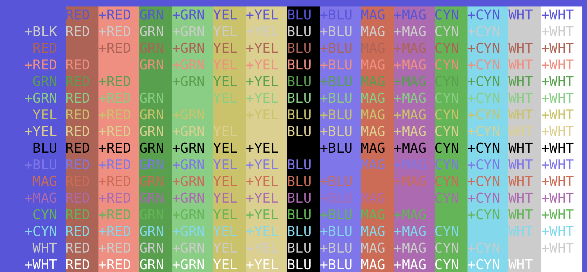

# blink-msx-colors

[MSX](https://en.wikipedia.org/wiki/MSX)-like colorscheme for
[Blink shell.](https://blink.sh/)

## Installation

1. Go to `themes` folder in this repository.
2. Open `MSX-like.js` file there.
3. Press "Raw" button in the top right corner.
4. Marvel at the colorscheme and copy its URL. It is probably
   `https://raw.githubusercontent.com/avysk/blink-msx-colors/blah/themes/MSX-like.js`.
5. Open Blink.
6. Type `config` at Blink prompt.
7. Open "Appearance".
8. In "THEMES" section choose "Add a new theme".
9. Enter any name and paste in "JS THEME FILE" the URL you have copied in
   step 3.
10. Press "Import".
11. Press "Save".
12. Choose new colorscheme.

Now new Blink terminals will use the new theme.

## Appearance

## License

[BSD 2-clause](LICENSE.md)

## Acknowledgements

The values for colors come from
[this page](https://paulwratt.github.io/programmers-palettes/HW-MSX/HW-MSX-palettes.html).
